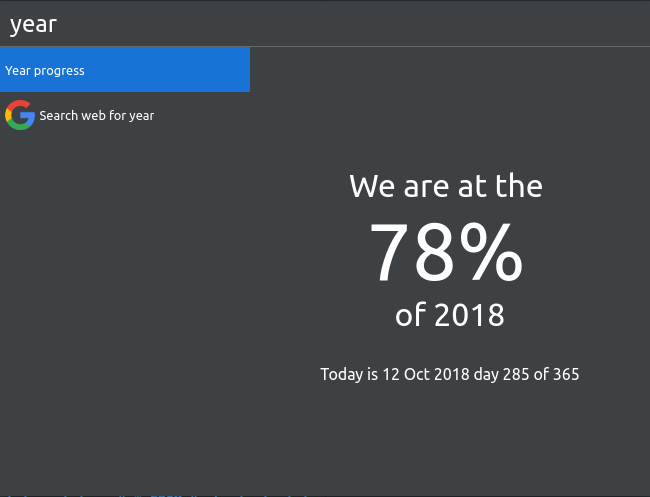

# Cerebro year progress

> [Cerebro](http://www.cerebroapp.com) plugin to show your local and external IP addresses

## Usage

In Cerebro, type `year` to see the current percentage of the year.

## Related

- [Cerebro](http://github.com/KELiON/cerebro) – main repo for Cerebro app;
- [create-cerebro-plugin](https://github.com/KELiON/create-cerebro-plugin) – boilerplate to create plugins for Cerebro app

## License

MIT © [Dídac Sabatés](http://sabatesduran.net)
